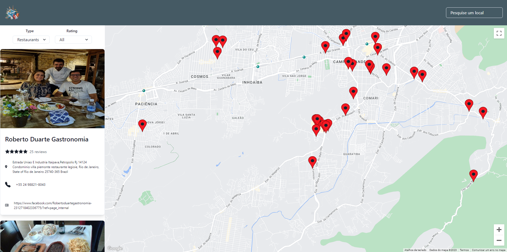

# Traveling




> Este projeto representa a fusão perfeita entre tecnologia e viagens. Uma plataforma de pesquisa de hotéis, atrações e restaurantes, complementada por um mapa interativo. Aqui, os viajantes podem planejar cada detalhe da sua jornada, descobrindo os melhores lugares para ficar, visitar e saborear, tudo em um único lugar. Explore o mundo com praticidade e confiança.


## 💻 Pré-requisitos

Antes de começar, verifique se você atendeu aos seguintes requisitos:

* Você instalou a versão mais recente de `Node`
* Você tem uma máquina `Windows / Linux / Mac`.

## 🚀 Instalando Traveling

Para instalar o Traveling, siga estas etapas:

```
https://github.com/rshmdev/Traveling.git
```

## ☕ Usando Traveling

Para usar Traveling, siga estas etapas:

Npm:
```
npm i
```

Yarn:
```
yarn install
```

# Inicie o projeto

Yarn:

```
yarn start 
```
 
Npm
```
npm start 
```

Esse projeto está sob licença. Veja o arquivo [LICENÇA](LICENSE.md) para mais detalhes.
